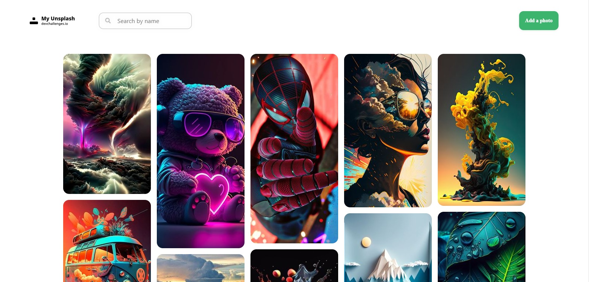
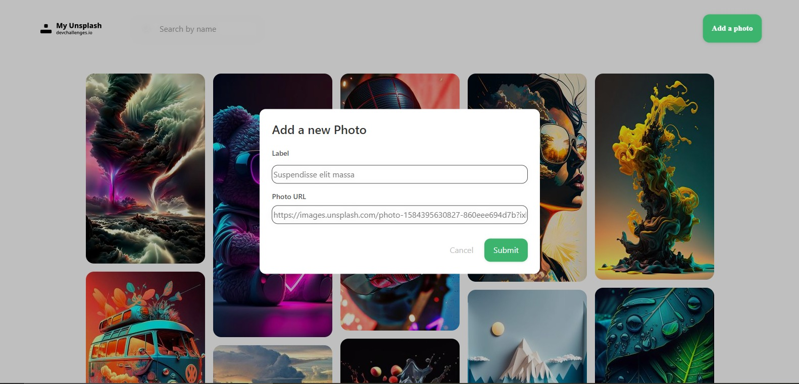
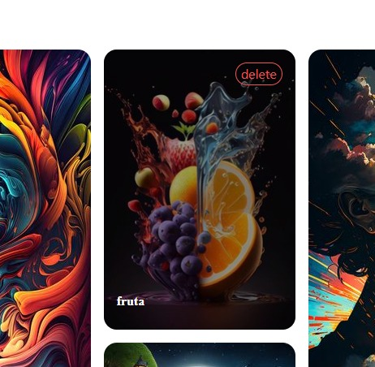

<h1 align="center">My Unsplash</h1>

<div align="center">
   Solution for a challenge from  <a href="http://devchallenges.io" target="_blank">Devchallenges.io</a>.
</div>

<div align="center">
  <h3>
    <a href="/">
      Demo
    </a>
    <span> | </span>
    <a href="https://github.com/emily883/Unsplash">
      Solution
    </a>
    <span> | </span>
    <a href="https://devchallenges.io/challenges/rYyhwJAxMfES5jNQ9YsP">
      Challenge
    </a>
  </h3>
</div>

<br />

[](https://choosealicense.com/licenses/mit/)

<br />

<!-- TABLE OF CONTENTS -->

## Table of Contents

- [Overview](#overview)
  - [Built With](#built-with)
- [Features](#features)
- [How to use](#how-to-use)
  - [Using Docker](#using-docker)
- [Contact](#contact)
- [Stack](#stack)

<Br />
<Br />

## My Unsplash
---
<br />

The customized image gallery website is an intuitive platform that allows users to upload and organize images using descriptive labels. Users can easily search for images using keywords and enjoy customizable display options. It is a versatile and secure tool for efficiently creating and managing online image galleries.

<br />

<br />


<!-- OVERVIEW -->

## Overview

<br/>



<br />




<br />

<div align="center"> 




</div>


<br />

---

### Built With

- [Vue 3 Js](https://vuejs.org/)
- [Express Js](https://expressjs.com/)

<br />

## Features

This application/site was created as a submission to a [DevChallenges](https://devchallenges.io/challenges) challenge. The [challenge](https://devchallenges.io/challenges/rYyhwJAxMfES5jNQ9YsP) was to build an application to complete the given user stories.

<br />

> ## How To Use
>
> > ### Using docker
> >
> > <br />
> >
> > To run this project, you will need to add the following  environment variables to your .env file on your **api**  folder 
> >
> > <br />
> >
> > `DB_USERNAME=test`
> >
> >`DB_PASSWORD=test`
> >
> >`DB_HOST_URL=test`
> >
> >`DATABASE_NAME=test`
> > <br />
> > <br />
> 

<br />

## Deployment

To streamline the deployment process of this project, I highly recommend utilizing [Docker](www.docker.com). Once Docker is up and running on your machine, follow these simple steps in the project's root directory:

```bash
  > docker compose up
```

This command will initiate the deployment process and ensure smooth execution of the project.


> Don't forget to take reference from the **.env.example** files in the **/api** and **/client** directories. Make sure to fill in the respective information in the **.env** files for both the API and the client. This ensures that the project has the necessary environment variables properly configured for successful deployment.

<br />

>> After the deployment process is complete, you can access the application by navigating to **localhost** on port **3001** in your web browser.

<br />

<br />


## Stack 

- [Node.js](https://nodejs.org/)
- [Docker](https://www.docker.com/)
- [Vitest](https://vitest.dev/)

#### **Client:** 

- [Husky](https://typicode.github.io/husky/#/?id=automatic-recommended)
- [Vue3 Js](https://vuejs.org/)


#### **Server:** 
- [Express Js](https://expressjs.com/)
- [Prisma](https://www.prisma.io/)


## Contact

- Website [emilycruz.xyz](https://emilycruz.xyz)/
- GitHub [@emily883](https://github.com/emily883)
- Linkedin [Emily Cruz Gutiérrez](https://www.linkedin.com/in/emily-fullstack/)


## License

[MIT](https://choosealicense.com/licenses/mit/)

